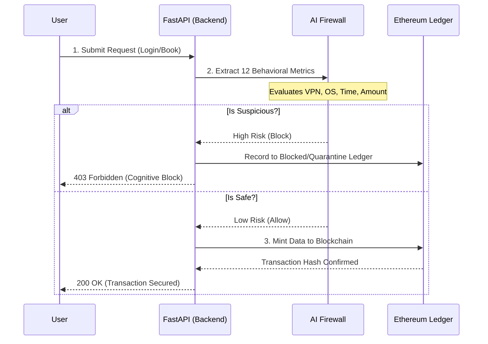

# Global Transit Security Architecture 🛡️

A master-level security framework integrating **Machine Learning** for real-time behavioral anomaly detection, backed by an immutable **Ethereum Blockchain** to ensure data integrity and transparency.

This project implements a **Zero-Trust Architecture** for a transit and ticketing system. Even if an attacker compromises a user's password, the AI Cognitive Firewall will block the transaction if the user's behavioral footprint (e.g., login hour, VPN usage, OS type) indicates malicious intent.

---

## 🔄 System Flow



---

## 🏗️ Detailed Component Architecture

The system is decoupled into three major components:

### 1. AI Cognitive Firewall (Machine Learning)
*   **Location:** `best_model.pkl`, `scaler.pkl`, `imputer.pkl`
*   **Purpose:** Acts as the brain of the security system. Before any transaction touches the database, the FastAPI backend passes the user's metadata through this XGBoost/Scikit-Learn pipeline. 
*   **Capabilities:** Evaluates exactly 12 different behavioral features in real-time (such as `is_vpn`, `login_frequency`, `transaction_amount`, `last_login_diff`). It assigns a probability score of an attack and strictly enforces edge rules (e.g., $>10$ failed attempts = auto-lock).

### 2. Immutable Ledger (Blockchain Manager)
*   **Location:** `blockchain.py`, `Ticketing.sol`
*   **Purpose:** Centralized databases can be altered by rogue admins. Here, user identities and ticketing transactions are minted directly onto an Ethereum-compatible blockchain.
*   **Cryptographic Security:** Passwords are not saved in plain text. They are hashed using mathematical `bcrypt` salting before they ever touch the identity ledger.
*   **Graceful Degradation:** The `EthereumBlockchainManager` intelligently checks for a live Ethereum node (like Ganache). If it fails to connect, it falls back seamlessly to a local JSON file (`blockchain_ledger.json`), ensuring the app never crashes during development.

### 3. High-Performance REST Backend
*   **Location:** `main.py`
*   **Purpose:** Built on **FastAPI**, it serves as the asynchronous bridge between the User Frontend, the AI Models, and the Blockchain. It handles CORS, Pydantic data validation, and serves the core endpoints.

### 4. Glassmorphism UI
*   **Location:** `index.html`, `style.css`, etc.
*   **Purpose:** A modern, responsive frontend portal utilizing CSS radial gradients, blur filters, and micro-animations to create a premium "Glassmorphism" aesthetic for both passengers and system administrators.

---

## 📂 Repository Structure

```text
/
├── .env                        # Private environment variables (Provider URL, Contract)
├── requirements.txt            # Python dependencies (FastAPI, Web3, XGBoost, Bcrypt)
├── main.py                     # FastAPI entry point & core routing logic
├── blockchain.py               # Web3 manager, cryptographic auth & ledger fallback logic
├── Ticketing.sol               # Ethereum Smart Contract defining the Transaction struct
├── blockchain_ledger.json      # Fallback database / Mock Ledger (Auto-generated)
│
├── Machine Learning Artifacts/
│   ├── best_model.pkl          # Trained XGBoost/Scikit-Learn model weights
│   ├── scaler.pkl              # Data normalizer pipeline
│   ├── imputer.pkl             # Missing value handler
│   ├── model_comparison.py     # Script used to evaluate different ML models
│   └── raw_user_behavior_dataset.csv # Original synthetic training data
│
└── Frontend /
    ├── index.html              # Architecture Landing Page
    ├── style.css               # Core styling & animations
    ├── user_login.html         # Passenger Portal Auth
    ├── user_dashboard.html     # Passenger internal dashboard
    ├── admin_login.html        # Admin Auth
    ├── admin_dashboard.html    # Unified Admin Console
    └── passenger_booking.html  # Ticket booking interface
```

---

## 🚀 Key Features

*   **Behavioral Threat Detection:** Evaluates login frequency, transaction amount, OS type, VPN usage, and request rate to stop anomalous behavior.
*   **Cryptographic Passwords:** All user credentials are computationally hashed using `bcrypt` before reaching the ledger.
*   **Dual-Ledger Support:** Maintains a global history chain and a specific quarantine/blocked chain for auditing threats.
*   **Immutable Travel Records:** Once a ticket is booked or updated, it is permanently anchored to the blockchain using the `journeyDate` parameter for type safety.

---

## 💻 Getting Started

### Prerequisites
*   Python 3.9+
*   *(Optional)* Ganache or a local Ethereum Node

### 1. Installation

Clone the repository and install the required dependencies:

```bash
git clone <repository_url>
cd ai
pip install -r requirements.txt
```

### 2. Environment Setup

Create a `.env` file in the root directory and configure your Ethereum provider and Smart Contract address:

```env
PROVIDER_URL=http://127.0.0.1:7545
CONTRACT_ADDRESS=0x224222C7da2329d3d58f11b134C3800b8050ADef
```
*(If you are not running a local Ethereum node, the system will seamlessly fall back to using `blockchain_ledger.json` for storage).*

### 3. Running the API Server

Start the FastAPI application:

```bash
python main.py
```
*The backend API will be available at `http://localhost:8000`*

### 4. Running the Frontend

In a separate terminal, serve the static HTML files:

```bash
python -m http.server 8080
```
*Access the user interface at `http://localhost:8080`*

---

## 📡 Core API Endpoints

Interactive Swagger documentation is available at **`http://localhost:8000/docs`** while the server is running.

| Method | Endpoint | Description |
| :--- | :--- | :--- |
| `POST` | `/register` | Hashes password via bcrypt and mints identity to the blockchain. |
| `POST` | `/login` | Verifies cryptographic identity against the ledger. |
| `POST` | `/firewall/analyze` | Passes user metrics through the ML pipeline to detect threats. |
| `POST` | `/book` | Appends a new transportation ticket block to the global ledger. |
| `GET` | `/blockchain/global` | Retrieves the entire history of all booked tickets. |
| `GET` | `/blockchain/blocked` | Retrieves the quarantine ledger of blocked attacks/users. |
